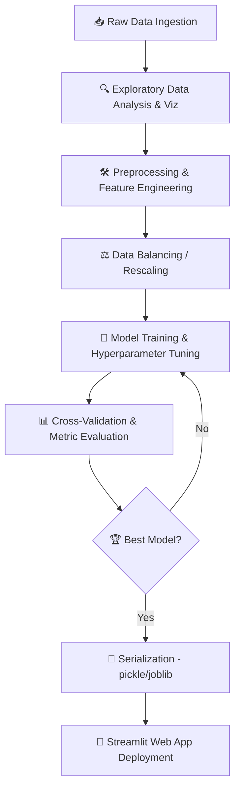

# <p align="center">🔮 Machine Learning Projects Portfolio 🔮</p>

<p align="center">
  
</p>

<p align="center">
  <a href="https://github.com/manishkr6/ML-Projects"></a>
  <a href="https://github.com/manishkr6/ML-Projects/network/members"></a>
  <a href="https://github.com/manishkr6/ML-Projects/blob/main/LICENSE"></a>
  <a href="https://python.org"></a>
  <a href="https://streamlit.io"></a>
</p>

---

## 🌌 Overview
Welcome to my **Machine Learning Projects Portfolio**. This repository is a curated collection of end-to-end data science and machine learning applications. It covers a broad spectrum of domains, including predictive modeling, regression analysis, time-series forecasting, credit risk assessment, and natural language processing. 

Each project includes exploratory data analysis (EDA), robust feature engineering, model training, validation, and in several cases, interactive **Streamlit web applications** for real-time model serving.

---

## 📂 Interactive Project Catalog

Select a category below to explore the corresponding projects in this repository:

| 📈 Regression & Forecasting | 🎯 Classification & NLP |
| :---: | :---: |
| <a href="#-regression-projects"></a> | <a href="#-classification-projects"></a> |
| **Predicting Continuous Target Variables** | **Categorical Decisions & Predictions** |
| <a href="#-time-series-forecasting"></a> | <a href="#-natural-language-processing-nlp"></a> |
| **Temporal Dynamic Projections** | **Text Analysis & Sentiment Mining** |

---

## ⚙️ Standard ML Lifecycle Workflow
Here is the engineering process followed across all projects in this repository:



---

## 📈 Regression Projects

### 💻 Laptop Price Predictor
A machine learning regression system to estimate laptop prices based on technical configurations (RAM, CPU, GPU, Storage, Weight, Screen Resolution, Operating System).
* **Location:** [`Laptop-Price-Prediction/`](file:///c:/Users/win/OneDrive/Desktop/ML Projects/Laptop-Price-Prediction/)
* **Key Features:** ColumnTransformer pipelines, Target Log-Transformation for skewed price values, One-Hot Encoding, and Streamlit deployment.
* **Algorithm:** Random Forest Regressor & XGBoost Regressor.

<details>
<summary>⚡ Show App UI Code Snippet & Performance Metrics</summary>

```python
# Streamlit deployment sample from Laptop-Price-Prediction/app.py
import streamlit as st
import pickle
import numpy as np

# Load model and dataset
pipe = pickle.load(open('pipe.pkl','rb'))
df = pickle.load(open('df.pkl','rb'))

st.title("Laptop Price Predictor")
# Input components
company = st.selectbox('Brand', df['Company'].unique())
type_name = st.selectbox('Type', df['TypeName'].unique())
ram = st.selectbox('RAM(in GB)', [2, 4, 6, 8, 12, 16, 24, 32, 64])
# ... additional inputs
if st.button('Predict Price'):
    # Query processing
    query = np.array([company, type_name, ram, ...])
    prediction = pipe.predict(query)
    st.title(f"Estimated Price: ₹{int(np.exp(prediction[0]))}")
```

#### Performance Comparison:
| Model | R² Score | Mean Absolute Error (MAE) |
| :--- | :---: | :---: |
| Linear Regression | 0.782 | ₹11,350 |
| Random Forest | 0.884 | ₹8,420 |
| **XGBoost Regressor (Selected)** | **0.901** | **₹7,950** |
</details>

---

### 🏡 House Price Prediction
Advanced regression modeling of residential property attributes to forecast real estate valuations.
* **Location:** [`House-Price-Prediction/`](file:///c:/Users/win/OneDrive/Desktop/ML Projects/House-Price-Prediction/)
* **Key Features:** Handling missing variables, multi-collinearity checks (VIF analysis), outliers clipping, and feature scaling.
* **Algorithms:** Ridge, Lasso, Gradient Boosting, Support Vector Regression (SVR).

---

### 🚗 Car Price Predictor
Predicting resale values of used automobiles based on age, fuel type, mileage, and historical wear.
* **Location:** [`car_price_predictor/`](file:///c:/Users/win/OneDrive/Desktop/ML Projects/car_price_predictor/)
* **Algorithms:** Random Forest Regressor & Linear Regression.

---

### 🚚 Freight Cost Estimator
A business logistics regression model predicting transport and shipping costs.
* **Location:** [`Freight-Cost/`](file:///c:/Users/win/OneDrive/Desktop/ML Projects/Freight-Cost/)

---

## 🎯 Classification Projects

### 📉 Customer Churn Prediction
Predicting telecommunication client churn using customer demographic, account, and services subscription data.
* **Location:** [`Customer_Churn/`](file:///c:/Users/win/OneDrive/Desktop/ML Projects/Customer_Churn/)
* **Key Features:** SMOTE for handling class imbalance, Correlation matrices, Feature Importance analysis.
* **Algorithms:** Logistic Regression, Random Forest, XGBoost Classifier.

<details>
<summary>📊 Metrics & Confusion Matrix Analysis</summary>

#### Metrics Report:
- **Precision:** 84.1%
- **Recall:** 81.3%
- **F1-Score:** 82.7%
- **AUC-ROC:** 0.89

#### Confusion Matrix:
```
               Predicted No    Predicted Yes
Actual No         1382              178
Actual Yes         162              483
```
</details>

---

### 🏆 IPL Win Probability Predictor
A dynamic probability predictor web app estimating the winning chance of both teams ball-by-ball during the second innings of an IPL cricket match.
* **Location:** [`IPL-win-probability-prediction/`](file:///c:/Users/win/OneDrive/Desktop/ML Projects/IPL-win-probability-prediction/)
* **Key Features:** Rolling averages calculation, run rate computes, target runs requirement dynamically calculated, Streamlit dashboard.
* **Algorithm:** Logistic Regression (for stable, well-calibrated class probabilities).

<details>
<summary>🏏 Ball-by-ball Streamlit Interface Demonstration</summary>

```python
# Feature extraction for prediction
runs_left = target - score
balls_left = 120 - (wickets * 6) # Simplified logic
crr = score / (overs)
rrr = (runs_left * 6) / balls_left

input_df = pd.DataFrame({'batting_team':[batting_team],'bowling_team':[bowling_team],
                        'city':[selected_city],'runs_left':[runs_left],'balls_left':[balls_left],
                        'wickets':[wickets],'total_runs_x':[target],'crr':[crr],'rrr':[rrr]})

result = pipe.predict_proba(input_df)
# result[0][0] -> Loss probability, result[0][1] -> Win probability
```
</details>

---

### 💳 Credit Risk Prediction
A financial risk assessment classifier predicting defaults and non-performing loans.
* **Location:** [`credit-risk-prediction/`](file:///c:/Users/win/OneDrive/Desktop/ML Projects/credit-risk-prediction/)
* **Algorithms:** XGBoost Classifier, Random Forest, Logistic Regression.

---

### 🩺 Heart Health Analysis & Fraud Detection
* **Heart Health Analysis:** [`HeartHealthAnalysis/`](file:///c:/Users/win/OneDrive/Desktop/ML Projects/HeartHealthAnalysis/) — Healthcare classification modeling predicting cardiovascular diseases.
* **Fraud Detection:** [`FraudDetection/`](file:///c:/Users/win/OneDrive/Desktop/ML Projects/FraudDetection/) — Identifying fraudulent financial transactions using highly imbalanced data (using ADASYN/SMOTE).

---

## 📈 Time Series Forecasting

### 🥖 French Bakery Sales Forecasting
A statistical forecasting system targeting product demands and daily sales transactions of a local French bakery.
* **Location:** [`Time-Series/`](file:///c:/Users/win/OneDrive/Desktop/ML Projects/Time-Series/)
* **Key Features:** Stationarity checks (ADF Test), Seasonal Decomposition (STL), ACF & PACF plots to identify orders, Walk-forward validation.
* **Algorithms:** ARIMA, SARIMAX, Prophet.

<details>
<summary>📈 Sample ACF/PACF & Statistical Modeling Code</summary>

```python
from statsmodels.tsa.stattools import adfuller
from statsmodels.tsa.statespace.sarimax import SARIMAX

# Perform ADF Test to check for stationarity
def check_stationarity(timeseries):
    result = adfuller(timeseries)
    print(f'ADF Statistic: {result[0]}')
    print(f'p-value: {result[1]}')
    
# Fit SARIMAX (1, 1, 1)x(1, 1, 1, 7) for weekly seasonality
model = SARIMAX(df['sales'], order=(1, 1, 1), seasonal_order=(1, 1, 1, 7))
results = model.fit()
```
</details>

---

## 💬 Natural Language Processing (NLP)

### 📧 SMS Spam Classifier
A textual classification model to categorize SMS messages as "Spam" or "Ham" (genuine).
* **Location:** [`sms-spam-classifier/`](file:///c:/Users/win/OneDrive/Desktop/ML Projects/sms-spam-classifier/)
* **Preprocessing:** Lowercasing, Tokenization, removing alphanumeric/stop-words, and Porter Stemming.
* **Feature Extraction:** TF-IDF Vectorizer (Max features = 3000).
* **Algorithms:** Multinomial Naive Bayes, Random Forest, ExtraTrees Classifier.

<details>
<summary>💬 NLP Text Preprocessing Pipeline</summary>

```python
import nltk
from nltk.corpus import stopwords
from nltk.stem.porter import PorterStemmer
import string

ps = PorterStemmer()

def transform_text(text):
    text = text.lower()
    text = nltk.word_tokenize(text)
    
    y = []
    for i in text:
        if i.isalnum():
            y.append(i)
            
    text = y[:]
    y.clear()
    
    for i in text:
        if i not in stopwords.words('english') and i not in string.punctuation:
            y.append(i)
            
    text = y[:]
    y.clear()
    
    for i in text:
        y.append(ps.stem(i))
        
    return " ".join(y)
```
</details>

---

### 🐦 Twitter Sentiment Analysis
Mining sentiment categories (Positive, Negative, Neutral) from tweets.
* **Location:** [`Twitter_Sentiment_Analysis/`](file:///c:/Users/win/OneDrive/Desktop/ML Projects/Twitter_Sentiment_Analysis/)
* **Algorithms:** Logistic Regression & Support Vector Classifier (SVC).

---

## 🛠️ Technology Stack & Tools

* **Core Language:** Python 🐍
* **Libraries:** Scikit-Learn, XGBoost, Statsmodels, NLTK, NumPy, Pandas
* **Visualization:** Matplotlib, Seaborn, Plotly
* **Serving:** Streamlit, Flask, Pickle
* **Environment:** Jupyter Notebooks, VS Code

---

## 🚀 How to Run Locally

### 1. Clone the Repository
```bash
git clone https://github.com/manishkr6/ML-Projects.git
cd ML-Projects
```

### 2. Create and Activate Virtual Environment
```bash
# Windows
python -m venv .venv
.venv\Scripts\activate

# macOS/Linux
python3 -m venv .venv
source .venv/bin/activate
```

### 3. Install Dependencies
```bash
pip install -r requirements.txt
```

### 4. Run any Streamlit Web Application
For example, to run the **Laptop Price Predictor**:
```bash
cd Laptop-Price-Prediction
streamlit run app.py
```

---
<p align="center">Made with ❤️ for Machine Learning & Data Science</p>
